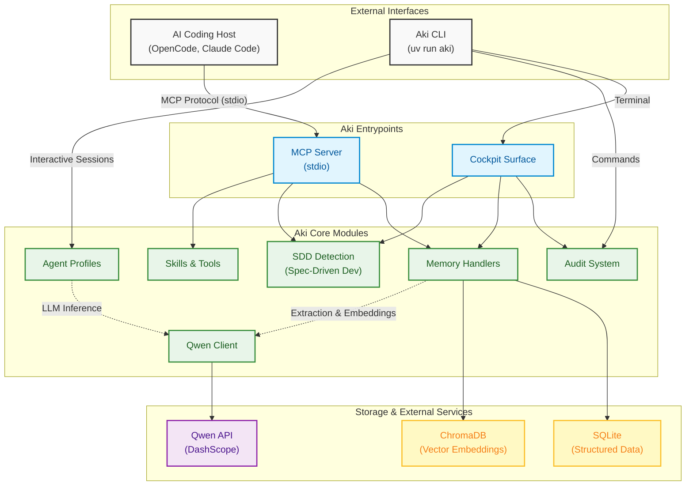

# Aki

**Persistent project memory and operational context for AI coding agents.**

Built for the **Qwen Cloud Global AI Hackathon Series**, Aki turns a repo into a durable workspace an agent can return to: project memory, resumable sessions, operational posture, MCP bootstrap, and SDD-aware context in one local-first tool.


## Why Aki

AI coding agents are powerful, but they forget too much between sessions.

Aki fixes that by giving agents a persistent, project-scoped memory layer and a repo-aware operating surface. Instead of starting every session from scratch, an agent can recover prior decisions, resume a session checkpoint, inspect project health, and work with the same conventions the repo already established.

This repository is intentionally positioned as an **open-source hackathon product**, not a hosted SaaS:

- **local-first** by default;
- **MCP-native** for real coding-agent workflows;
- **Qwen-powered** when cloud extraction/explanations help;
- **useful without Qwen credentials** for core memory and audit flows.

## What makes it submission-ready

### Product strengths

| Area | What Aki provides |
|---|---|
| Persistent memory | Durable project facts, decisions, events, and procedures backed by SQLite + ChromaDB. |
| Session continuity | Resumable interactive sessions with stored `session:last` pointers and per-session checkpoints. |
| Operational visibility | Cockpit overview, project registry, health check, structured audit reports, and JSON-friendly deployment logging. |
| MCP bootstrap | `aki mcp-config` and `aki mcp-setup` for OpenCode and Claude Code integration. |
| Specialized agents | Configurable planner / builder / reviewer-style profiles with tool and memory policies. |
| Project audit | Read-only audit passes for tests, SDD completeness, git hygiene, env/config, MCP readiness, and memory posture. |
| SDD-aware workflow | Detects proposal/spec/design/tasks artifacts, injects SDD context into chat, and can bootstrap `docs/sdd/`. |
| Git bootstrap | Built-in git operations include safe repository initialization through `git_ops.init` in agent workflows. |
| Qwen + Alibaba compatibility | Default Qwen endpoint targets DashScope international (`dashscope-intl.aliyuncs.com`), giving a concrete Alibaba/Qwen integration path. |

### Demo value in one sentence

**Aki helps an agent behave less like a stateless chatbot and more like a repo-aware engineering teammate.**

## Quickstart

### Requirements

- Python 3.11+
- [`uv`](https://docs.astral.sh/uv/)
- Optional: `QWEN_API_KEY` or `DASHSCOPE_API_KEY` for Qwen-powered extraction/explanations

### 1) Install and sync

```bash
git clone https://github.com/Akicoders/aki.git
cd aki
uv sync --all-extras
```

Or use the installer:

```bash
sh install.sh
```

### 2) Verify the environment

```bash
uv run aki doctor
```

### 3) Open the product surface

Run Aki inside a git project with no subcommand:

```bash
uv run aki
```

This opens the **operational cockpit**, which summarizes:

- project health;
- pending action items;
- memory posture;
- SDD status.

### 4) Generate an audit report

```bash
uv run aki audit aki
```

Audit reports are written to `docs/audits/` and cover tests, SDD, git hygiene, env/config, MCP readiness, and memory posture.

### 5) Connect Aki to an MCP host

Generate config:

```bash
uv run aki mcp-config opencode
uv run aki mcp-config claude-code
```

Or apply it automatically:

```bash
uv run aki mcp-setup opencode
uv run aki mcp-setup claude-code
```

### 6) Start the MCP server

```bash
uv run aki mcp
```

## Core capabilities

### Persistent memory for coding workflows

Aki stores:

- **events** for conversational history and activity;
- **facts** for durable project knowledge;
- **procedures** for repeatable workflows;
- **decisions** that should influence future agent behavior.

Core memory tooling is available through MCP:

- `memory_context`
- `memory_search`
- `memory_save`
- `memory_extract`
- `memory_explain`

Without Qwen credentials, `memory_save`, `memory_search`, and `memory_context` still work.

### Resumable sessions

Interactive mode supports explicit sessions, auto-resume through `session:last`, and checkpoint rehydration per session:

```bash
uv run aki interactive
uv run aki interactive --new-session
uv run aki interactive --profile reviewer
```

Inside interactive mode, `/sessions` lists prior sessions for the current project.

### Specialized agent profiles

Aki includes a profile system for specialized agents with scoped tools and memory policies.

Inspect configured profiles:

```bash
uv run aki agents
```

See [`docs/agent-profiles.md`](docs/agent-profiles.md) for the configuration model.

### Operational cockpit and project registry

Browse known projects and jump into their cockpit views:

```bash
uv run aki projects browse
uv run aki cockpit --interactive
```

This makes Aki more than a memory store: it becomes a lightweight control plane for agent-ready repositories.

### SDD-aware development

Aki detects Spec-Driven Development artifacts in `docs/sdd/`, `.sdd/`, or `openspec/` and can bootstrap a new SDD workspace:

```bash
uv run aki sdd-init
```

This is especially useful for hackathon demos because it shows memory, planning, and delivery working together in one workflow.

## Configuration

For manual setup:

```bash
cp .env.example .env
```

Relevant Qwen / DashScope settings:

```bash
QWEN_API_KEY=your_qwen_api_key_here
# or
# DASHSCOPE_API_KEY=your_dashscope_api_key_here
QWEN_BASE_URL=https://dashscope-intl.aliyuncs.com/compatible-mode/v1
QWEN_MODEL=qwen3.7-max
QWEN_EXTRACTION_MODEL=qwen3.7-plus
QWEN_CONSOLIDATION_MODEL=qwen3.7-max
QWEN_EMBEDDING_MODEL=text-embedding-v3
```

Relevant local storage defaults:

```bash
MEMORY_DB_PATH=data/agentos.db
MEMORY_CHROMA_PATH=data/chroma_db
MEMORY_EMBEDDING_MODEL=sentence-transformers/all-MiniLM-L6-v2
MEMORY_MAX_CONTEXT_TOKENS=8000
```

## Demo framing

If you are evaluating Aki as a hackathon product, the strongest sequence is:

1. open the cockpit with `uv run aki`;
2. run `uv run aki audit aki` to show structured repo assessment;
3. show `uv run aki agents` to demonstrate specialized agent profiles;
4. generate host bootstrap with `uv run aki mcp-config opencode` or `aki mcp-setup --dry-run`;
5. demonstrate interactive/session continuity or MCP memory retrieval.

Use these docs for the full evaluator path:

- [`docs/demo.md`](docs/demo.md) — evaluator walkthrough
- [`docs/demo-script.md`](docs/demo-script.md) — short live demo script
- [`docs/devpost-description.md`](docs/devpost-description.md) — submission copy

## Architecture at a glance



Public CLI entry point:

```bash
aki
```

Compatibility alias retained during transition:

```bash
agentos
```

## Related docs

- [`docs/integration.md`](docs/integration.md) — host integration details
- [`docs/agent-profiles.md`](docs/agent-profiles.md) — specialized profile configuration
- [`docs/troubleshooting.md`](docs/troubleshooting.md) — common setup issues
- [`docs/sdd/`](docs/sdd/) — proposal, spec, design, and task artifacts
- [`CONTRIBUTING.md`](CONTRIBUTING.md) — contributor workflow

## Development quality

The repository includes:

- GitHub Actions CI for linting and tests;
- a dedicated pytest suite under `tests/`;
- a documented development flow in [`CONTRIBUTING.md`](CONTRIBUTING.md).

Typical local checks:

```bash
uv run ruff check .
uv run pytest tests/ -q
uv run aki mcp-config opencode
```

## Scope and non-goals

Aki is a strong open-source hackathon MVP, but it is **not** presented here as a hosted production platform.

Out of scope in this repository today:

- REST API or web dashboard
- multi-user / team tenancy
- WhatsApp, Telegram, or voice ingestion
- HTTP `/health` endpoints as a primary interface

Container files such as `Dockerfile` and `docker-compose.prod.yml` are deployment helpers, but the main product interface remains **local stdio MCP**.

## License

MIT. See [`LICENSE`](LICENSE).
