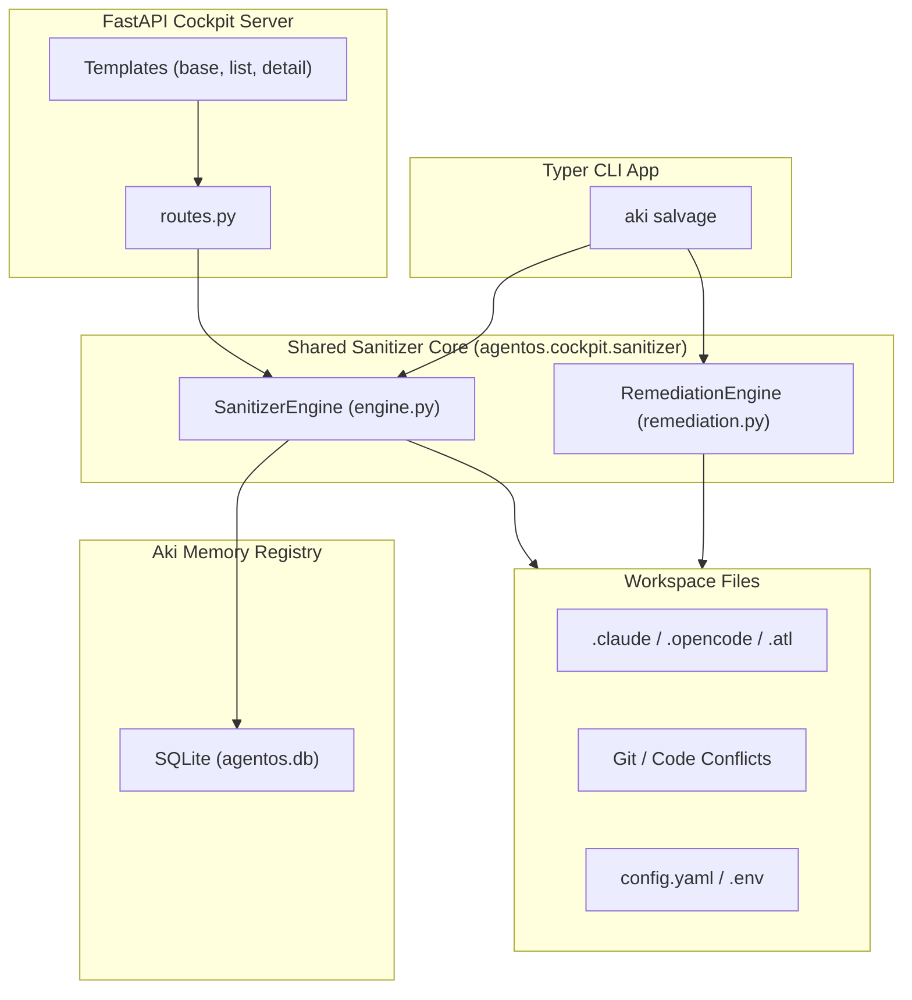

# Design: Aki Sanitizer & Immune System (Vibecoding Antivirus)

**Date**: 2026-07-09  
**Status**: APPROVED  
**Author**: Antigravity (AI Coding Assistant)  

---

## 1. Context and Problem Statement

During rapid development (often referred to as "vibecoding"), codebases can quickly accumulate technical debt, merge conflicts, dead modules, missing configurations, and unstructured agent configurations. 

Aki needs a centralized **Sanitizer & Immune System** (a "vibecoding antivirus") that:
1. Performs deterministic and agent-assisted scans for project chaos (conflicts, config drift, dead assets).
2. Parses agent/workspace metadata from `.claude`, `.opencode`, `.atl`, and `.gemini` configurations to understand active constraints (Immune Context).
3. Queries Aki memory to reconstruct a chronological "Memory Ledger" of key architectural and design decisions.
4. Safely cures and auto-remediates configurations and code smells under human confirmation.

---

## 2. Architecture & Component Diagram

The engine follows a **Shared Core Architecture (Approach B)**, exposing functionality to both the Typer CLI and the FastAPI web cockpit.



---

## 3. Data Models & API Specifications

### 3.1. Scan Diagnosis Report Model
```python
@dataclass
class ScanReport:
    project_key: str
    root_path: Path
    scanned_at: datetime
    chaos_level: Literal["clean", "warning", "critical"]
    findings: list[ScanFinding]

@dataclass
class ScanFinding:
    id: str
    category: str  # e.g., "git", "config", "conflict", "sdd"
    severity: Literal["low", "medium", "high", "critical"]
    title: str
    evidence: str
    remediation_command: str
    autofixable: bool
```

### 3.2. Immune Context Model
```python
@dataclass
class ImmuneContext:
    active_skills: list[dict[str, str]]  # list of skill name & path
    rules_count: int
    system_rules: list[str]  # loaded from AGENTS.md / .claude configurations
    custom_personas: list[str]
```

### 3.3. Memory Ledger Entry Model
```python
@dataclass
class LedgerEntry:
    id: str
    timestamp: datetime
    event_type: str  # e.g., "decision", "task_completion"
    title: str
    content: str
    author: str  # "human" or "agent"
```

---

## 4. Remediation Sequence (Cure Routine)

When executing a remediation/salvage via `aki salvage`:

1. **Commit Checkpoint**: Create a temporary git branch or git stash checkpoint to prevent uncommitted change loss.
2. **Deterministic Fixes**:
   - Restore missing configuration templates (`.env.example` -> `.env`).
   - Clean known structural anomalies (e.g., standard `.gitignore` template for Python/Node).
3. **Agent-Assisted Fixes**:
   - For circular imports, spaghetti files, or git merge conflicts: prompt the user and invoke the Qwen LLM engine to perform targeted, surgical refactoring.
4. **Immunization**:
   - Write/ensure `.agents/AGENTS.md` and `docs/sdd/` are initialized so future agent steps follow the core design patterns.

---

## 5. Web UI Specifications ("Immunity Hub")

The project detail page in the web cockpit is upgraded with a tabbed "Immunity Hub":

* **Tab 1: Memory Ledger**:
  - Vertical timeline UI displaying a history of decisions recorded in the Aki SQLite database (`memory_events` table filtered by `type="decision"`).
* **Tab 2: Workspace Immunization**:
  - Lists parsed instructions from `.claude/`, `.opencode/`, and `.atl/skill-registry.md` to show what skills and custom behavioral rules are binding the project.
* **Tab 3: Antivirus Diagnosis**:
  - Displays the active chaos status card. Suggests terminal commands to cure the codebase.
